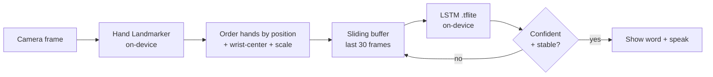

# 🤟 Real-Time Sign Language Translator

An on-device, real-time translator for **dynamic word/phrase signs** (Indian Sign
Language by default — the pipeline is language-agnostic, so you train it on
whatever signs you record). A phone camera reads your hands, a small temporal
model recognizes the sign, and the word appears as text and is spoken aloud —
all **offline, on the device**.

> **Scope (honest):** this recognizes a fixed vocabulary of whole-sign gestures —
> it's **word/phrase recognition**, not full grammatical sentence translation.

<!-- Add your own demo GIF here once recorded -- it's the single highest-impact
     thing in the whole README. -->
<!--  -->

---

## How it works



Each frame becomes a small vector of hand landmarks (not raw pixels), a short
sequence of those vectors feeds an LSTM, and the model exports to a ~775 KB
TensorFlow Lite file that runs on a phone with no server.

The **same feature recipe runs in Python (training) and Dart (app)** — hands
ordered by wrist x-position, each hand translated to its wrist and scaled by its
max reach. Keeping these identical is what makes the model work on-device.

---

## Repo layout

```
sign-translator/
├── README.md
├── ROADMAP.md                 # full step-by-step build plan
├── training/                  # Python: record → preprocess → train → test
│   ├── collect_data.py
│   ├── preprocess.py
│   ├── train.py
│   ├── test_model.py          # live webcam test before going mobile
│   ├── requirements.txt
│   ├── model/                 # exported model lands here
│   └── data/                  # your recorded sequences (gitignored)
└── app/                       # Flutter (Android): on-device inference
    ├── lib/
    │   ├── main.dart
    │   ├── landmark_service.dart   # camera + hand_landmarker
    │   ├── classifier.dart         # tflite buffer + inference
    │   └── ui/translator_page.dart
    └── assets/                 # put sign_model.tflite + labels.json here
```

---

## Quickstart

### A. Train the model (Python, on your laptop)

```bash
cd training
python -m venv venv && source venv/bin/activate   # Windows: venv\Scripts\activate
pip install -r requirements.txt

python collect_data.py     # record ~40 takes of each sign
python preprocess.py       # normalize + build dataset.npz + labels.json
python train.py            # train LSTM, print accuracy, export sign_model.tflite
python test_model.py       # live webcam test — the gate before mobile
```

Requires **Python 3.9–3.12** (a hard requirement of mediapipe).

### B. Run the app (Flutter, Android)

```bash
# copy the two trained files into the app:
cp training/sign_model.tflite app/assets/
cp training/labels.json       app/assets/

cd app
flutter pub get
flutter run        # on a real Android phone
```

Full device setup (permissions, min SDK, JDK) is in [`app/SETUP.md`](app/SETUP.md).

---

## Model card

| | |
|---|---|
| **Task** | Dynamic sign (word/phrase) recognition |
| **Input** | 30 frames × 126 features (2 hands × 21 landmarks × x,y,z) |
| **Model** | 2-layer LSTM → Dense, softmax (unrolled for clean TFLite export) |
| **Size** | ~775 KB TFLite, builtin ops only (no Flex delegate) |
| **Landmarks** | MediaPipe Hand Landmarker (same model in training and on-device) |
| **Vocabulary** | _your recorded signs_ — fill in once trained |
| **Accuracy** | _fill in from train.py / confusion_matrix.png_ |

<!--  -->

---

## Limitations & future work

- Recognizes a **fixed vocabulary**, not free-form sentences.
- **Android-first** (the `hand_landmarker` plugin is Android-only today).
- Front-camera mirroring varies by phone; a `mirrorX` toggle in `classifier.dart`
  fixes a left/right mismatch if needed.
- Future: add body pose for signs that use it; scale to a public dataset
  (e.g. **INCLUDE** for ISL, **WLASL** for ASL — note their research-only licenses).

---

## Acknowledgements

Built with [MediaPipe](https://developers.google.com/mediapipe),
[TensorFlow Lite](https://ai.google.dev/edge/litert), and the Flutter packages
`hand_landmarker`, `tflite_flutter`, `camera`, and `flutter_tts`.

## License

MIT — see [LICENSE](LICENSE).