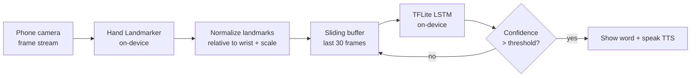

# Real-Time Sign Language Translator — Build Roadmap

A portfolio project that recognizes **dynamic word/phrase signs** in real time from a
phone camera, fully **on-device**, and shows the translated word as text (and speech).

> **Scope honesty (put this in your README too):** this recognizes a fixed vocabulary of
> *whole-sign gestures* — it is **word/phrase recognition**, not full grammatical sentence
> translation. Saying so up front makes the project look more mature, not less.

---

## 1. Architecture at a glance



**Why this shape works:** you never classify raw pixels. Each frame becomes a small vector
of hand landmarks (21 points × x,y,z per hand). A short sequence of these vectors is what
the model reads, so the model stays tiny (a few hundred KB) and runs in real time on a phone.

---

## 2. Tech stack

**Training side (Python, on your laptop):**
- `mediapipe` (Tasks API) — extract hand landmarks
- `opencv-python` — webcam capture + collection UI
- `numpy` — feature vectors
- `tensorflow` / `keras` — build & train the LSTM, export TFLite
- `scikit-learn`, `matplotlib` — metrics + confusion matrix

**Mobile side (Flutter):**
- `camera` — live frames
- `hand_landmarker` — on-device hand landmarks (Android; same MediaPipe model as training)
- `tflite_flutter` — run the exported model on-device
- `flutter_tts` — speak the recognized word (nice UX touch)

> **#1 pitfall to design around:** the landmark format and normalization must be **identical**
> in training (Python MediaPipe) and inference (Flutter). Using MediaPipe Hand Landmarker on
> *both* sides keeps the 21-point schema matched. Decide your normalization once and reuse it
> verbatim.

---

## 3. Suggested repo structure

```
sign-translator/
├── README.md                 # demo GIF, architecture, metrics, setup  ← the showcase
├── ROADMAP.md                # this file
├── training/
│   ├── collect_data.py       # webcam → save landmark sequences
│   ├── preprocess.py         # normalize + assemble dataset
│   ├── train.py              # build/train LSTM, eval, export .tflite
│   ├── model/                # saved keras model + sign_model.tflite
│   └── data/                 # recorded sequences (gitignore the big stuff)
└── app/                      # Flutter project
    ├── lib/
    │   ├── main.dart
    │   ├── landmark_service.dart   # camera + hand_landmarker
    │   ├── classifier.dart         # tflite buffer + inference
    │   └── ui/
    └── assets/
        └── sign_model.tflite
```

---

## 4. Phase-by-phase plan

### Phase 0 — Setup & scope  ⏱ ~half a day
- [ ] Pick the sign language (ISL recommended) and lock a **starter vocabulary of ~8 signs**.
- [ ] Decide: hands-only for v1 (2 hands × 21 × 3 = **126 features/frame**). Add body pose later only if some signs are ambiguous without it.
- [ ] Fix the sequence length (e.g., **30 frames**, ~1 second).
- [ ] Create the repo and a Python virtualenv.

### Phase 1 — Prove it on the desktop FIRST  ⏱ ~2–3 days
> De-risk the ML before touching Flutter. A working desktop translator is a milestone by itself.
- [ ] Webcam loop with OpenCV + MediaPipe; draw the landmarks so you can see tracking work.
- [ ] Confirm you can extract a clean 126-length vector per frame.

### Phase 2 — Data, training, export  ⏱ ~3–5 days
- [ ] `collect_data.py`: for each sign, record ~30–50 takes of 30-frame sequences. Vary hand position, lighting, distance.
- [ ] Normalize: translate each frame's points relative to the wrist, scale by hand size (makes it position/scale invariant).
- [ ] Build a small LSTM: e.g. `LSTM(64) → LSTM(128) → Dense(64, relu) → Dense(n_signs, softmax)`.
- [ ] Train, then evaluate with a **confusion matrix** (save it for your README).
- [ ] Live-test in the OpenCV window with a sliding buffer. Iterate on weak signs.
- [ ] Export to TFLite (`TFLiteConverter`), verify the `.tflite` predicts correctly in Python.

✅ **Milestone: a real-time sign translator running on your laptop.**

### Phase 3 — Flutter skeleton  ⏱ ~2–3 days
- [ ] New Flutter app, wire up the `camera` package (request permissions).
- [ ] Add `hand_landmarker`, stream landmarks from the camera feed.
- [ ] Draw landmark dots over the camera preview as visual proof it works.

### Phase 4 — On-device inference  ⏱ ~3–5 days
- [ ] Bundle `sign_model.tflite` in `assets/`, load with `tflite_flutter` (run on an isolate).
- [ ] Reuse the **exact** Phase-2 normalization in Dart.
- [ ] Implement the 30-frame sliding buffer → build the 126-length input → run inference.
- [ ] Debounce: only commit a prediction when confidence clears a threshold for a few frames.
- [ ] Show the word on screen; add `flutter_tts` to speak it.

✅ **Milestone: the translator works on your phone, offline.**

### Phase 5 — Polish & UX  ⏱ ~2–4 days
- [ ] Confidence indicator, "building a sentence" mode (append recognized words), clear/reset.
- [ ] Settings (camera switch, threshold). Clean, simple UI.

### Phase 6 — Make it a *showcase*  ⏱ ~1–2 days  (don't skip — this is your stated goal)
- [ ] README with a **demo GIF/video** at the top — this is the single highest-impact thing.
- [ ] Embed the architecture diagram (the Mermaid above renders on GitHub).
- [ ] A short **model card**: vocabulary, dataset size, accuracy, confusion matrix image.
- [ ] Clear setup steps for both `training/` and `app/`.
- [ ] Honest "Limitations & future work" section (iOS support, larger vocab, body pose).
- [ ] Add a LICENSE (MIT is fine).

---

## 5. Scaling later (optional, for "future work")
- Add **body pose** (BlazePose / ML Kit Pose, 33 landmarks) for signs that use body position.
- Swap to a bigger public dataset: **INCLUDE** (Indian SL) or **WLASL** (Word-Level ASL) —
  but you must run their videos through the *same* landmark extractor to keep feature parity.
- Try a small **1D-CNN or Transformer** over the landmark sequence and compare accuracy.

---

## 6. Realistic expectations
- This is a **multi-week** project; the difficulty is mostly in data quality and train/inference
  feature parity, not the model itself.
- **Android first** for the demo (`hand_landmarker` is Android-only today; iOS needs ML Kit or a custom bridge).
- A sliding window adds ~1s of latency — normal and fine.
- More, more varied training takes = the biggest accuracy lever.